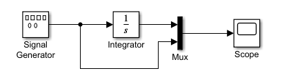
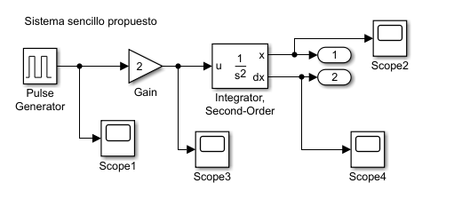
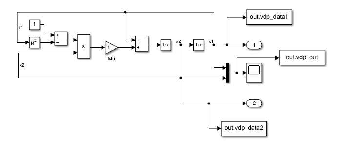
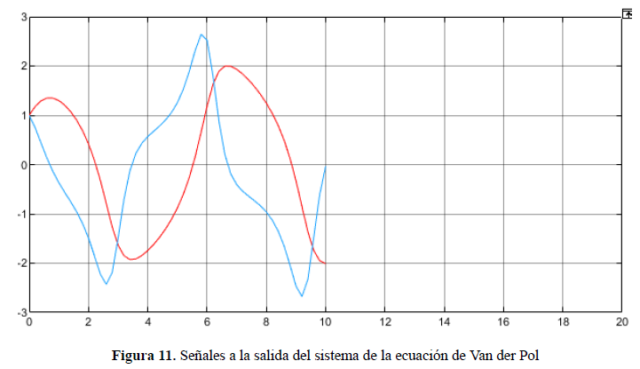
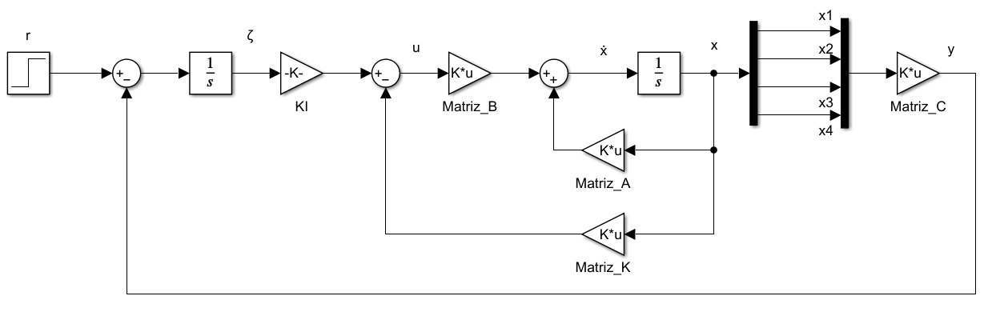
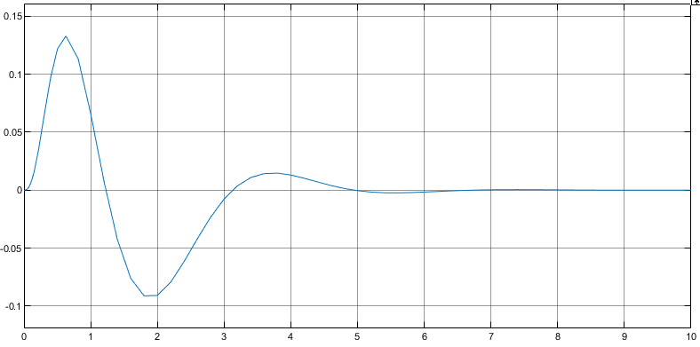
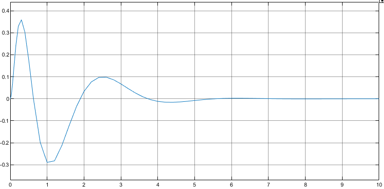
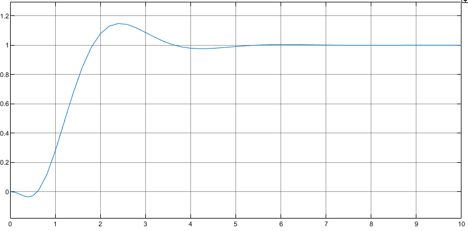
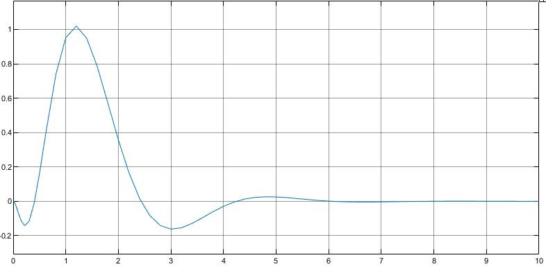
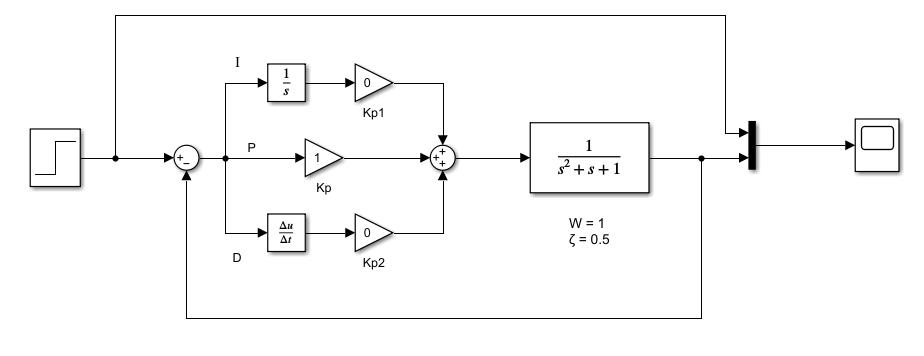

# LAB0 - Laboratorio de Simulink

En esta práctica del Laboratorio se pretende familiarizarse con el ambiente de
Modelado y Simulación MATLAB y SIMULINK.

- Informe de la práctica: [Informe Lab0](https://doc-08-3c-docstext.googleusercontent.com/export/rs79jpa7t9n4hg04potucpm49c/078d1jmnlfobtr9gcpa2qp16a0/1730938875000/109826783603832800500/109826783603832800500/1cZKeyanoTs5BAHUib7E9lyImzpsUSY0sU9Xgm3x12vg?format=pdf&id=1cZKeyanoTs5BAHUib7E9lyImzpsUSY0sU9Xgm3x12vg&token=AC4w5VgOU-RDmuffX-sh2Vd1cO3US9GVhA:1730938813934&ouid=109826783603832800500&includes_info_params=true&usp=drive_web&cros_files=false&tab=t.0&inspectorResult=%7B%22pc%22:19,%22lplc%22:16%7D&dat=AOBvIb3bX-Pu57TlwJNODawP0DbhPdvUGLVO19IsfW3qpVC3cyVZWmFNGzz87YVw7q1OVTbpQ3iCmLouBbx_sQkbF1_xnpTvhb0UmZNMVZWk7q8iWrOcCpNBQqZCMpJDXNE9VnYPh4PGIVc5qp9wK6GIwd5xf1c2ZiTYKIP0pYD4DijRwVLcqQlnkFMXVck9IEmZ1L9RBiNWm2WH8WhtjnaXIhI7oypdyHISD1avrwldEV4yMqW7dU2GES1hIj41uHSIyhnUwWSibzwUSF2RBqYKveD_8pPhbJuU4B4gec_YNRNZ4WWvAzHD0SqqF7scFCfoVUKYRuVeET3SA8HACEEc0E4jVM19x160jfjOiGSZREDoBGOehc6BZJJgh25hgQ5S5f34FBNqA4ddCImN6NsmMcZih-VKTx82Xv1wVLgtDqWRsjQyLRAZfU-afRH_XVN3oiQi84tqjfyVJW8F3-sK_LlRYTCHi6eJ0Ewsf4gL2t1YlppOE-cNZwrKFVotSWjPq8yQ8TR_2CFWRyJ4KmjfaXPNeTNW_EMqzpUTBEqXkY_mMtrvQEwqDAeaaBdeo-D81nvKCXi4015b4YiZIP57urDiImJsrpe4F52sXbqMDPESL5sdZ-rX3jU759f1FpMFDqDKBhdLT5huHfQVRi0cNNgmaY7HE6IVgExy7cX8hq5a1qcLRs9cqJljJOyn0FAleX6SGcUalTLcyoLmF9zx5b09tqt7puTk5Bj5TT2kVW7P5856O73Md3x2FSF5cIXrrkRZhg6NClKDssyoCDDUhjP8pXvHWTc5RiXkPT-MMujKL2HlKcqG1vRuijrcyfqD0poSuc8F5a2IkXz3uDKZ5nz68U8EAz0mgJDezW0ZzLmmacOSqxADfjmvdE4DMnPB3gkoXmxF3z3J9liNrSxEK-Pk7HwAjz36yk71eejyAR5BxekqjsHIQMkC8A)

## Prácticas realizadas

### Sistema con Integrador

### Sistema con Integrador de segundo orden

### Ecuación de Van der Pol

### Péndulo Invertido

- Ángulo del péndulo

- Velocidad angular del péndulo

- Posición del carro

- Velocidad del carro

### Funciones de Transferencia

