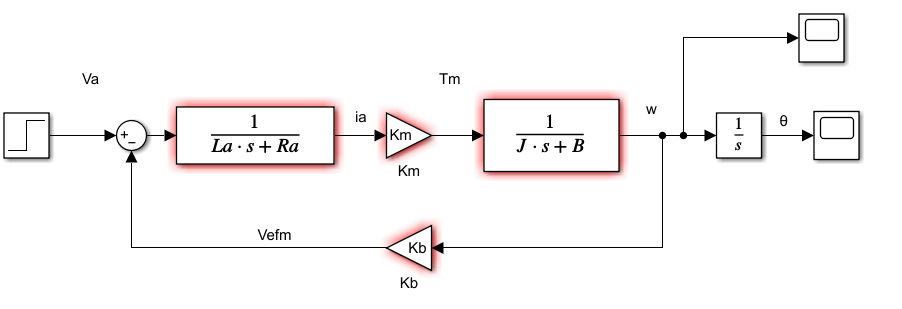
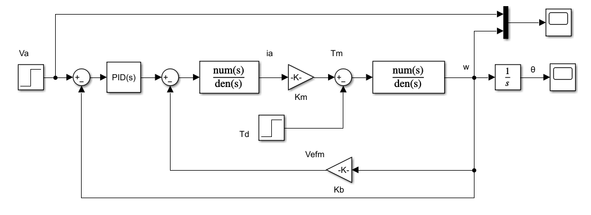
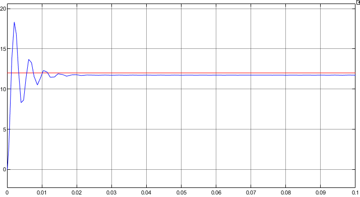
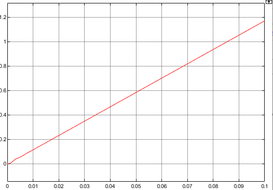
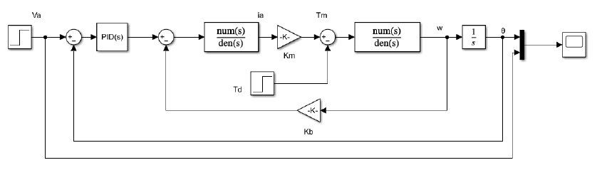
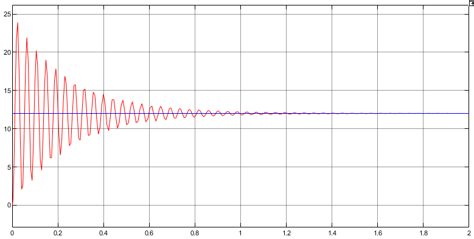
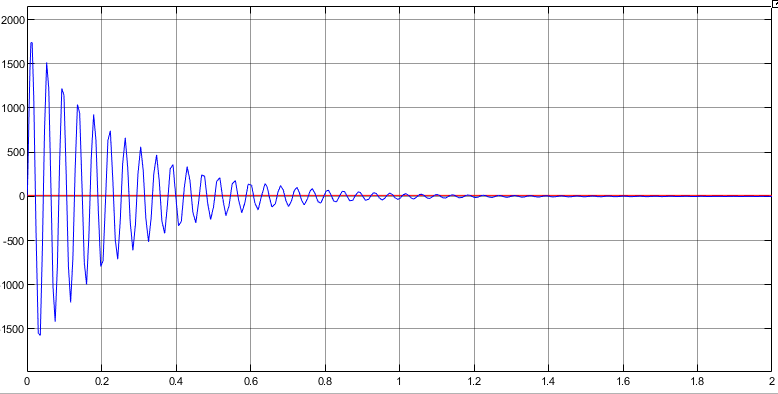

# LAB1 - Motor DC

En esta práctica del Laboratorio se estudiará el principio de funcionamiento y de control del
motor de corriente directa, accionamiento fundamental en los sistemas robóticos.

## Diagrama de bloques Motor DC no controlado

## Velocidad angular sin controlador

## Posición angular sin controlador

## Control de Velocidad

### Velocidad angular con controlador proporcional

### Posición angular con controlador proporcional

## Control de Posición

### Posición angular con controlador PI sintonizado

### Velocidad angular con controlador PI sintonizado

