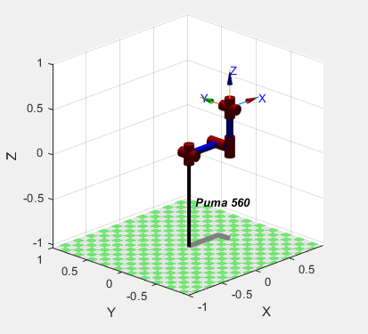
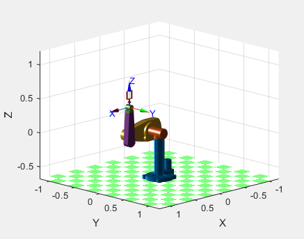
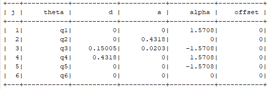
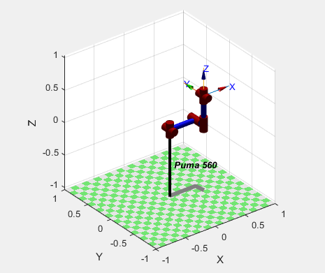
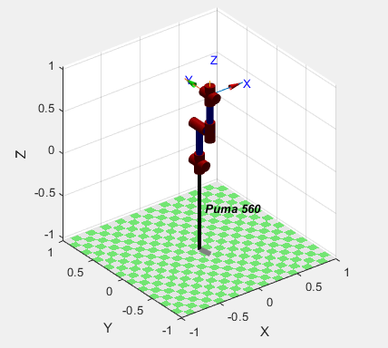
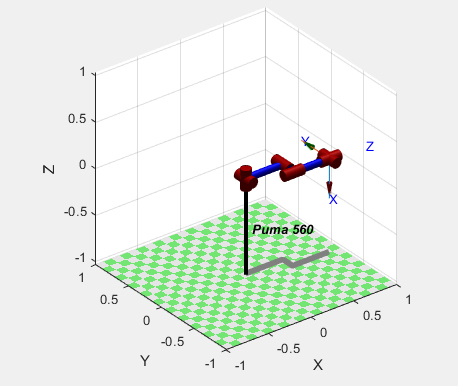
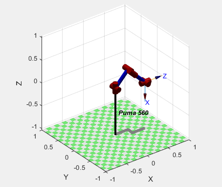

# LAB2 - Robotics Toolbox

Esta práctica de laboratorio consiste en la familiarización con un manipulador 3-dimensional
de uso comercial o industrial como el PUMA 560, a través del Software Robotics Toolbox.
Se realizará una simulación gráfica y el estudio de la Cinemática Directa e Inversa.

Robotics Toolbox: https://petercorke.com/toolboxes/robotics-toolbox/

## Robot PUMA 560

## Robot PUMA 560 3D

## Tabla de parámetros D-H del PUMA 560 de Robotics Toolbox

## Posiciones definidas del robot PUMA 560

### Zero Angle

### Ready

### Stretch

### Nominal
