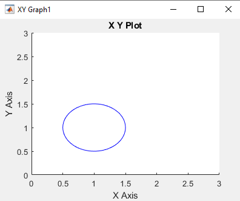

# PROYECTO - Brazo Robótico de 2 Grados de Libertad

Proyecto de mecatrónica de un brazo robótico plano de 2 enlaces o “links”. El robot realiza una sencilla
trayectoria circular.
Primero se modela el robot usando Solidworks y luego se exporta el modelo a Matlab usando la
herramienta Simscape multibody link para que podamos construir el algoritmo de control y
simular el comportamiento real del robot tanto gráficamente como usando el explorador de
mecánica de Matlab.

Para ver la demostración del movimiento, hacer click en la imagen de abajo.

## Modelado del robot con SolidWorks

## Modelado del robot con Matlab y Simulink

### Modelo Mecánico del robot

### Sistema de control del robot

## Simulación del movimiento del brazo robótico

### Trayectoria deseada

### Trayectoria obtenida

